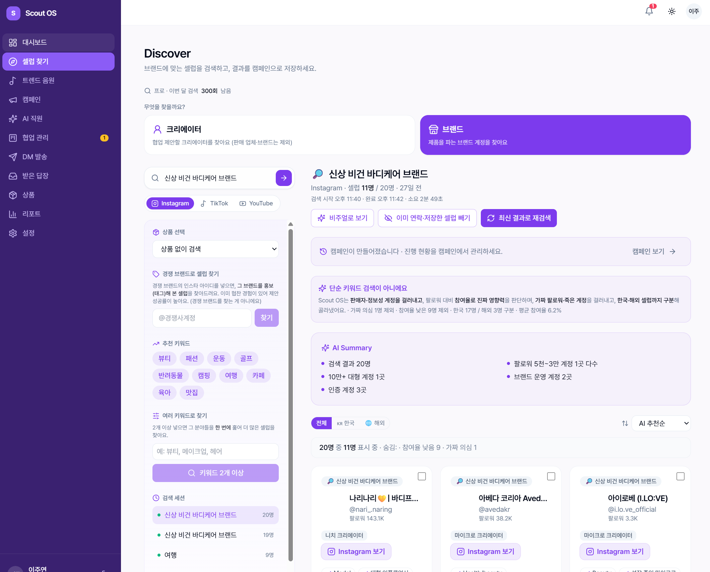
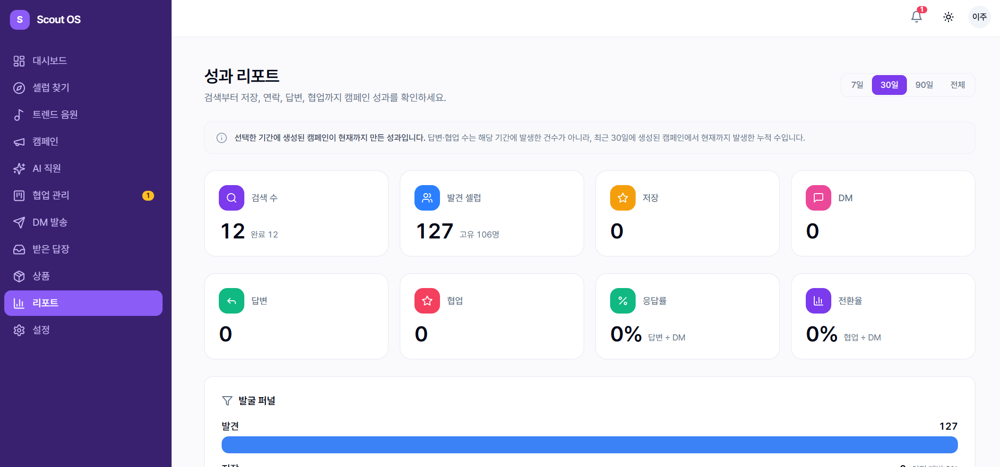

# Scout OS

**브랜드에 맞는 인스타그램 셀럽을 AI로 발굴하고, 컨택(DM)부터 협업 성과까지 관리하는 SaaS**
🔗 서비스: [scout-os.kr](https://scout-os.kr)

상품·키워드를 입력하면 AI가 어울리는 인플루언서를 찾아 참여율·진짜 영향력까지 검증하고, 맞춤 DM 생성과 컨택 상태(CRM), 성과 리포트까지 하나의 흐름으로 제공합니다. 기획·UI/UX 디자인·프론트엔드·백엔드·배포·운영까지 **1인으로 개발·운영** 중인 실서비스입니다.

> 제품 철학·로드맵은 [VISION.md](./VISION.md) 참고.

---

## 주요 기능

- **AI 셀럽 발굴** — 상품·키워드를 분석해 체험단·공구·협찬에 맞는 인스타 셀럽을 추천
- **가짜 팔로워 검증** — 팔로워 수가 아닌 참여율·실제 영향력을 기준으로 필터링, 적합도 스코어링
- **맞춤 DM 생성 & 인박스(CRM)** — 셀럽별 DM 초안 생성·발송, 받은 답장·컨택 상태 관리
- **성과 리포트** — 검색 → 발견 → 저장 → DM → 답변 → 협업으로 이어지는 퍼널과 응답률·전환율 지표
- **회원·요금제·결제** — Supabase Auth 기반 인증/권한, 무료·베이직·프로 요금제(검색 횟수 차감)와 결제 연동

---

## 화면

| 화면                 | 설명                                              |
| -------------------- | ------------------------------------------------- |
| Discover (셀럽 찾기) | AI 검색·필터·검증 결과와 AI Summary — 메인 진입점 |
| 성과 리포트          | 검색·발견·DM·협업 퍼널과 전환 지표                |
| 캠페인 · 받은 답장   | 발굴 결과 캠페인 저장, 답장·협업 상태 CRM         |
| 인증 · 요금제        | Supabase Auth(이메일/비밀번호), 플랜별 권한·결제  |




---

## 기술 스택

| 영역         | 사용 기술                                                                   |
| ------------ | --------------------------------------------------------------------------- |
| Frontend     | **Next.js 14 (App Router)**, **React 18**, **TypeScript**, **Tailwind CSS** |
| UI           | Radix UI, class-variance-authority, lucide-react, next-themes               |
| 상태·데이터  | TanStack React Query, react-hook-form + zod                                 |
| Backend / DB | **Supabase** (PostgreSQL, Auth, RLS), Next.js Route Handlers                |
| AI           | Anthropic / OpenAI / Google AI (LLM API 연동)                               |
| 수집(Worker) | Playwright 기반 인스타그램 수집 워커 (별도 패키지)                          |
| 인프라·도구  | Vercel 배포, pnpm + Turborepo 모노레포, Vitest, Husky, Prettier             |

---

## 아키텍처 (모노레포)

```
scout-os/
├─ apps/
│  └─ web/            # Next.js 14 웹앱 (프론트엔드 + API Route Handlers)
├─ packages/
│  ├─ database/       # Supabase 스키마·타입 공유
│  ├─ worker/         # Playwright 인스타 수집 워커
│  └─ config/         # 공용 설정(ESLint/TS 등)
└─ supabase/          # SQL 마이그레이션 · RLS 정책
```

- **보안**: 민감 토큰은 `service_role` 키로 서버에서만 접근, RLS로 테이블 접근 잠금 (클라이언트 번들에 비밀키 미포함)
- **품질**: TypeScript 전면 적용, Vitest 테스트, Prettier/ESLint, Husky pre-commit

---

## 담당 역할

기획 · UI/UX 디자인 · 프론트엔드 · 백엔드 · 배포 · 운영 **전 과정 단독 수행** (AI 코딩 도구 활용). AI가 생성한 코드를 직접 검토·리팩터링해 운영 수준으로 완성.

---

## 로컬 실행

```bash
pnpm install
cp .env.example .env.local   # Supabase·AI 키 등 환경변수 설정
pnpm dev
```

> 실제 서비스 키(.env.local)는 저장소에 포함되지 않습니다.
